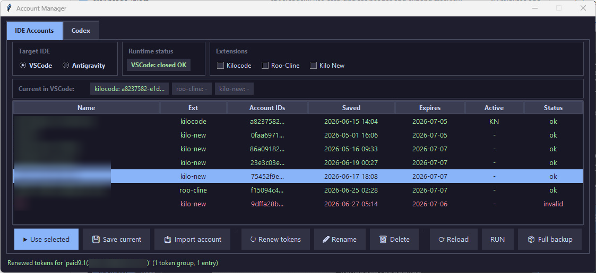

# vscode-ext-accounts

[🇺🇦 Українська](README.uk.md)



A Windows GUI utility for managing OpenAI OAuth sessions for Kilocode, Roo-Cline, and Kilo New, OMP OpenAI credentials, and standalone Codex.
It reads and writes account data stored in `state.vscdb` (AES-256-GCM via Windows DPAPI), `~/.local/share/kilo/auth.json`, `~/.omp/agent/agent.db`, and `~/.codex/auth.json`.

> [!IMPORTANT]
> **Built mainly for switching saved OpenAI accounts across supported clients.**
> Only OpenAI (`auth.openai.com`) is supported as the auth provider.


## Use Cases

**Switch between multiple IDE accounts**

You have several accounts and want to switch them in Kilocode, Roo-Cline, or Kilo New:

1. Sign in inside the target extension.
2. Open **IDE Accounts** → tick the slots you want to save → **Save current**.
3. Repeat for your other accounts.
4. Normally close VSCode / Antigravity before applying.
5. Select the saved account → tick the target slots → **Use selected**.

**Use one login for both extensions**

You authenticated in Roo-Cline and want the same session in Kilocode (or vice versa):

1. Save the current account in **IDE Accounts**.
2. Close the IDE.
3. Select the saved account → tick **Kilocode** and/or **Roo-Cline** → **Use selected**.

The token is automatically remapped to the correct extension slot, even if it was originally saved under a different one.

**Use the same account in Kilo New**

Kilo New stores tokens in `~/.local/share/kilo/auth.json` — a completely separate file from `state.vscdb`.
That auth file is shared for Kilo New regardless of whether you use it from VSCode or Antigravity.
The tool handles format conversion automatically:

1. Save the account with any extension (e.g. **Kilocode**).
2. Close the IDEs that may currently use Kilo New, or explicitly confirm the experimental live-write prompt for Kilo New-only switching.
3. Select the saved account → tick **Kilo New** → **Use selected**.

**Manage OMP OpenAI credentials**

OMP keeps its active OpenAI OAuth credentials in `~/.omp/agent/agent.db`:

1. Open the **OMP OpenAI** tab.
2. Use **Save current** to save the active OMP credential set, or **Import account** to create a saved set from JSON.
3. Use **Add to selected** to append credentials to an existing saved set.
4. Select a saved set → **Use selected** to replace the active OMP OpenAI credential set in `agent.db`.

An OMP saved set may contain multiple OpenAI credentials. Import accepts a JSON object or an array of objects; required fields are `access_token` and `refresh_token`, while `account_id`, `email`, `expires`, and `id_token` are optional (`expires` can be decoded from the access token).

**Import an IDE account from JSON**

You already have a token bundle and want to save it directly for IDE targets:

1. Open **IDE Accounts**.
2. Tick the target slots.
3. Click **Import account**.
4. Enter the account name.
5. Paste a JSON object or a one-item JSON array into the dialog.

Required fields: `access_token`, `refresh_token`, `id_token` (must be valid OpenAI OAuth tokens).
Optional fields: `account_id`, `expires`.

**Manage Codex separately**

Codex is not treated like an IDE extension slot. It has its own tab and its own auth file:

1. Open the **Codex** tab.
2. Use **Save current** to snapshot the current `~/.codex/auth.json`, or **Import Codex auth** to import another Codex auth file.
3. Select a saved Codex account → **Use selected** to write it back to `~/.codex/auth.json`.

`IDE -> Codex` import/apply is intentionally not supported because Codex requires `id_token`.

## Token Refresh

Saved profiles in `accounts/*.json` can be refreshed independently from the live IDE, OMP, and Codex storage via the OpenAI token endpoint (`https://auth.openai.com/oauth/token`).

- **Renew tokens** refreshes only the saved snapshot in `accounts/*.json`.
- It does **not** rewrite `state.vscdb`, `~/.local/share/kilo/auth.json`, `~/.omp/agent/agent.db`, or `~/.codex/auth.json` until you explicitly apply the profile with **Use selected**.
- **Auto-refresh** runs only while the app window is open.
- Auto-refresh tracks only tokens that are still valid and will expire soon (default threshold: `2 days`).
- Saved profiles that already contain expired tokens are shown as `expired` in red and are skipped by auto-refresh.
- You can still try **Renew tokens** manually for a saved profile with expired tokens, but older refresh tokens may fail with `401` / `invalid_grant`.
- If upstream returns a terminal auth error (`invalid_grant`, `already been used`, `revoked`, `sign in again`, etc.), auto-refresh is disabled for that refresh-token group across app restarts until you refresh it manually or replace the saved tokens.
- Console logs use `[manual-refresh]` and `[auto-refresh]` prefixes.

## Usage Limits

- The **Limits** column is available in the **IDE Accounts**, **OMP OpenAI**, and **Codex** tabs.
- **Fetch** updates the selected saved account; **Fetch all** updates every saved account in the current tab.
- Limits are fetched from the OpenAI usage endpoint using each saved access token and are cached in the saved profile. No usage polling runs automatically.
- Standard five-hour and weekly windows are shown as `remaining% / remaining%` (for example, `16% / 95%`). Other windows include their duration, such as `95% [30d]`.
- OMP profiles with multiple credentials show one limits summary per credential. If one request fails during a partial fetch, the previous cached snapshot for that credential is retained.

## Run locally

Requirements:

- Windows
- Python 3.10+
- `tkinter` (normally included with the standard Windows Python build)
- `cryptography`

Run from the repository root:

```bash
python -m pip install cryptography
python main.py
```

`main.py` bootstraps `src/` into `sys.path` and launches the Tk GUI.

The app has three tabs: **IDE Accounts**, **OMP OpenAI**, and **Codex**.

The **IDE** selector at the top chooses which IDE the GUI shows and targets (VSCode / Antigravity).

The **IDE Accounts** tab uses extension checkboxes to control which IDE slots are read or written:
- **Kilocode** — only `kilocode.kilo-code` (`state.vscdb`)
- **Roo-Cline** — only `rooveterinaryinc.roo-cline` (`state.vscdb`)
- **Kilo New** — `~/.local/share/kilo/auth.json` (shared Kilo New auth, not `state.vscdb`)

The **IDE Accounts** tab provides:
- **Use selected** — apply a saved IDE account to the checked targets
- **Save current** — save the selected IDE/Kilo New account state
- **Import account** — open a dialog and import an IDE account from pasted JSON
- **Export** — export the selected saved IDE account to JSON in a choice of formats
- **Fetch** — fetch usage limits for the selected saved IDE account
- **Fetch all** — fetch usage limits for all saved IDE accounts
- **Renew tokens** — refresh the saved IDE snapshot in `accounts/*.json`
- **Rename** — rename a saved IDE account
- **Delete** — remove a saved IDE account
- **Reload** — reread current state and saved accounts without modifying tokens
- **Full backup** — create a real ZIP snapshot of the app storages (`state.vscdb`, `Local State`, Kilo New auth, OMP `agent.db`, Codex auth)
- **Search and sort** — search saved accounts by email or Account ID and sort them by clicking table headers

`Import account` expects a JSON object or a one-item array. Required fields: `access_token`, `refresh_token`, `id_token`. Optional fields: `account_id`, `expires`.

`Export` opens a dialog to export the selected IDE account into one of 5 supported formats: `Full tokens` (Agent Identity / auth.json format), `Session JSON (Sub2API)`, `accessToken only`, `personal_access_token`, or `refresh_token only`. Output can be copied to clipboard or saved to a `.json` file.

The **Active** column shows where each account is currently applied: `VS` (VSCode), `AG` (Antigravity), `KN` (Kilo New).
The **Expires** column shows `expired` in red when a saved profile already contains an expired token.

The **Codex** tab is separate because Codex stores its token set in `~/.codex/auth.json` and requires `id_token`.

The **Codex** tab provides:
- **Use selected** — write a saved Codex account to `~/.codex/auth.json`
- **Save current** — save the current `~/.codex/auth.json`
- **Import Codex auth** — import another Codex auth file into saved accounts
- **Fetch** — fetch usage limits for the selected saved Codex account
- **Fetch all** — fetch usage limits for all saved Codex accounts
- **Renew tokens** — refresh the saved Codex snapshot in `accounts/*.json`
- **Rename** — rename a saved Codex account
- **Delete** — remove a saved Codex account
- **Reload** — reread current Codex state and saved accounts without modifying tokens

The **OMP OpenAI** tab provides:
- **Use selected** — replace the active OMP OpenAI credential set in `~/.omp/agent/agent.db`
- **Save current** — save the active OMP OpenAI credential set
- **Import account** — create a saved OMP set from one or more pasted JSON credentials
- **Add to selected** — append pasted credentials to the selected saved OMP set
- **Fetch** — fetch usage limits for the selected saved OMP set
- **Fetch all** — fetch usage limits for all saved OMP sets
- **Renew tokens** — refresh the saved OMP snapshot in `accounts/*.json`
- **Rename** — rename a saved OMP account set
- **Delete** — remove a saved OMP account set
- **Reload** — reread current OMP state and saved sets without modifying tokens

### Notes

- Choose **VSCode** or **Antigravity** at the top of **IDE Accounts**.
- Tick one or more extension checkboxes before **Save current** or **Use selected**.
- The target IDE normally must stay closed while **Use selected** is applying changes.
- If you are switching only the shared **Kilo New** auth, the GUI may offer an experimental live-write confirmation instead of forcing the IDE closed.
- Saved accounts are stored in the local `accounts/` directory.
- Before the app writes to IDE/Kilo New/Codex storage, it creates an automatic pre-write ZIP backup of the affected files.
- Before the app writes to OMP storage, it creates an automatic pre-write ZIP backup of `agent.db` and its SQLite WAL/SHM sidecar files when present.
- `Full backup` warns only when required files for the current IDE are missing, reports other absent storages as skipped/optional, and fails if no target files exist at all.
- Auto-refresh does not touch saved profiles that already contain expired tokens.
- **Renew tokens** updates only the saved profile until you apply it back with **Use selected**.
- Usage limits are updated only by **Fetch** / **Fetch all** and remain cached in the saved profile until the next successful fetch.

`Kilo New` always reads from and writes to `~/.local/share/kilo/auth.json`, and that file is used by Kilo New in both VSCode and Antigravity.

OMP OpenAI reads from and writes to `~/.omp/agent/agent.db`. Applying a saved OMP set replaces the active OpenAI credential set in that database.

Codex is intentionally isolated from IDE account switching. `IDE -> Codex` import/apply is not supported.

## Storage locations

| Storage | Path |
|---------|------|
| VSCode secrets | `%APPDATA%\Code\User\globalStorage\state.vscdb` |
| Antigravity secrets | `%APPDATA%\Antigravity\User\globalStorage\state.vscdb` |
| Kilo New auth | `~/.local/share/kilo/auth.json` |
| OMP OpenAI database | `~/.omp/agent/agent.db` (plus optional `-wal` / `-shm` files) |
| Codex auth | `~/.codex/auth.json` |
| Saved account profiles | `accounts/*.json` |

`state.vscdb` encryption key is read from `Local State` via Windows DPAPI — only works under the same Windows user.
