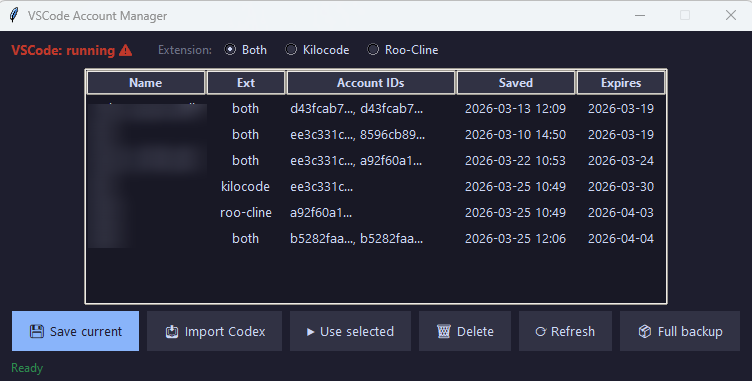

# vscode-ext-accounts

[🇬🇧 English](README.md)

GUI-утиліта для керування збереженими акаунтами розширень VSCode/Antigravity та окремим Codex.
Вона читає та записує дані акаунтів, що зберігаються у `state.vscdb` (AES-256-GCM через Windows DPAPI), `~/.local/share/kilo/auth.json` та `~/.codex/auth.json`.

## Сценарії використання

**Перемикання між кількома IDE-акаунтами**

Є кілька акаунтів і потрібно перемикати їх у Kilocode, Roo-Cline або Kilo New:

1. Увійти в потрібний акаунт всередині розширення.
2. Відкрити **IDE Accounts** → відмітити слоти, які потрібно зберегти → **Save current**.
3. Повторити для інших акаунтів.
4. Закрити VSCode / Antigravity перед застосуванням.
5. Вибрати збережений акаунт → відмітити цільові слоти → **Use selected**.

**Використати один логін у обох розширеннях**

Авторизувались у Roo-Cline і хочете ту саму сесію в Kilocode (або навпаки):

1. Зберегти поточний акаунт у **IDE Accounts**.
2. Закрити IDE
3. Вибрати збережений акаунт → відмітити **Kilocode** та/або **Roo-Cline** → **Use selected**

Токен автоматично переписується у правильний слот, навіть якщо спочатку був збережений під іншим.

**Використати той самий акаунт у Kilo New**

Kilo New зберігає токени в `~/.local/share/kilo/auth.json` — окремий файл, не `state.vscdb`.
Цей auth-файл спільний для Kilo New незалежно від того, чи ви використовуєте його у VSCode або Antigravity.
Конвертація формату відбувається автоматично:

1. Зберегти акаунт будь-яким розширенням (наприклад **Kilocode**)
2. Закрити IDE, які зараз можуть використовувати Kilo New
3. Вибрати збережений акаунт → відмітити **Kilo New** → **Use selected**

**Окреме керування Codex**

Codex не вважається IDE-extension-слотом. Для нього є окрема вкладка і окремий auth-файл:

1. Відкрити вкладку **Codex**.
2. Використати **Save current Codex**, щоб зберегти поточний `~/.codex/auth.json`, або **Import Codex auth**, щоб імпортувати інший Codex auth-файл.
3. Вибрати збережений Codex-акаунт → **Use selected Codex**, щоб записати його назад у `~/.codex/auth.json`.

Сценарій `IDE -> Codex` навмисно не підтримується, тому що Codex потребує `id_token`.

## Вимоги

```bash
pip install cryptography
```

## GUI

```bash
python main.py
```



У застосунку є дві вкладки: **IDE Accounts** і **Codex**.

Перемикач **IDE** вгорі визначає, яку IDE GUI показує і куди застосовує зміни (VSCode / Antigravity).

Вкладка **IDE Accounts** використовує галочки extension-слотів, щоб визначити що саме читати або записувати:
- **Kilocode** — тільки `kilocode.kilo-code` (`state.vscdb`)
- **Roo-Cline** — тільки `rooveterinaryinc.roo-cline` (`state.vscdb`)
- **Kilo New** — `~/.local/share/kilo/auth.json` (спільна Kilo New авторизація, не `state.vscdb`)

Вкладка **IDE Accounts** надає:
- **Save current** — зберегти поточний стан акаунтів для вибраних IDE/Kilo New слотів
- **Use selected** — застосувати збережений IDE-акаунт до відмічених цілей
- **Delete** — видалити збережений IDE-акаунт
- **Refresh** — оновити поточний стан і список збережених акаунтів
- **Full backup** — створити справжній ZIP-знімок сховищ застосунку (`state.vscdb`, `Local State`, Kilo New auth, Codex auth)

Колонка **Active** показує де акаунт зараз активний: `VS` (VSCode), `AG` (Antigravity), `KN` (Kilo New).

Вкладка **Codex** винесена окремо, тому що Codex зберігає токени в `~/.codex/auth.json` і потребує `id_token`.

Вкладка **Codex** надає:
- **Save current Codex** — зберегти поточний `~/.codex/auth.json`
- **Import Codex auth** — імпортувати інший Codex auth-файл у список збережених акаунтів
- **Use selected Codex** — записати збережений Codex-акаунт у `~/.codex/auth.json`
- **Delete** — видалити збережений Codex-акаунт
- **Refresh** — оновити поточний Codex-стан і список збережених акаунтів

### Нотатки

- Обирайте **VSCode** або **Antigravity** у верхній частині вкладки **IDE Accounts**.
- Перед **Save current** або **Use selected** потрібно відмітити хоча б одну галочку extension-слоту.
- Цільова IDE має залишатися закритою під час застосування через **Use selected**.
- Збережені акаунти лежать у локальній директорії `accounts/`.
- Перед записом у IDE/Kilo New/Codex застосунок автоматично створює ZIP-бекап файлів, які будуть змінені.
- `Full backup` показує warning лише коли відсутні required-файли поточної IDE, інші відсутні сховища рахує як skipped/optional, і падає, якщо не існує жодного target-файлу.

`Kilo New` завжди читається і записується через `~/.local/share/kilo/auth.json`, і цей файл використовується Kilo New як у VSCode, так і в Antigravity.

Codex навмисно ізольований від IDE-перемикань. Сценарій `IDE -> Codex` не підтримується.

`parse_vscdb.py` тепер є backend-модулем всередині `src/vscode_inject/`. Запускайте застосунок через `python main.py`.

## Місця зберігання

| Сховище | Шлях |
|---------|------|
| VSCode секрети | `%APPDATA%\Code\User\globalStorage\state.vscdb` |
| Antigravity секрети | `%APPDATA%\Antigravity\User\globalStorage\state.vscdb` |
| Kilo New авторизація | `~/.local/share/kilo/auth.json` |
| Codex авторизація | `~/.codex/auth.json` |
| Збережені профілі акаунтів | `accounts/*.json` |

Ключ шифрування `state.vscdb` береться з `Local State` через Windows DPAPI — працює тільки під тим самим користувачем Windows.
